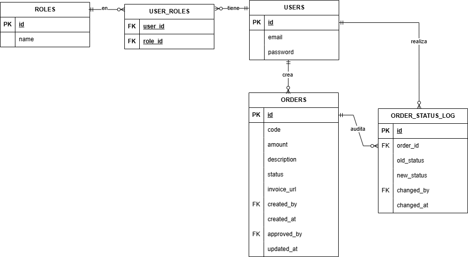
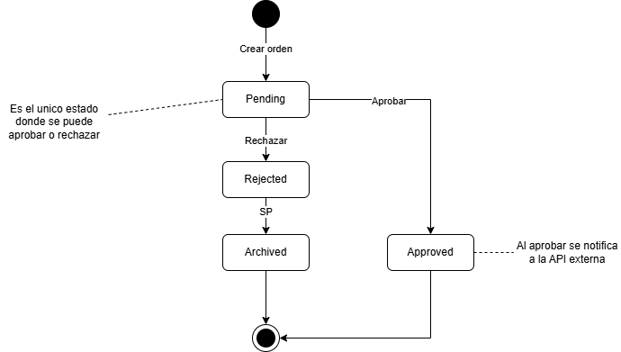

# Sistema de Órdenes de Pago

API REST para la gestión de órdenes de pago. Una orden
representa una solicitud de pago que debe pasar por una 
autorización donde un usuario con rol OPERATOR
crea la solicitud y un usuario con rol ADMIN
la autoriza o la rechaza. Esta separación 
de responsabilidades (quién pide vs. quién aprueba) 
es el núcleo del modelo de seguridad del sistema.

## Stack tecnológico

- Java 17, Spring Boot 3.5
- Spring Web, Spring Data JPA, Spring Security
- Autenticación con JWT
- PostgreSQL 16 como base de datos
- Flyway para el versionado del esquema
- Almacenamiento de archivos compatible con S3 (MinIO en local)
- Docker / Docker Compose
- Maven
- Fronted - Angular

## Diagramas

- ### Entidad - Relación


- ### Maquina de estados

## Ejecución del backend
**Prerequisitos:** Docker, JDK 17+ y Maven.
1. Levantar la infraestructura ``` docker compose up -d ```
2. Ejecutar la aplicación ``` mvn spring-boot:run ``` o desde el IDE, corriendo la clase `OrdersApplication`

La API queda en `http://localhost:8081`

**Usuarios sembrados** (se crean automáticamente al iniciar si no existen):

| Email | Contraseña | Rol |
|---|---|---|
| admin@orders.com | admin123 | ADMIN |
| operator@orders.com | operator123 | OPERATOR |

**Pruebas unitarias:** ``` mvn test ```

**Almacenamiento:** por defecto usa disco local. Para usar S3/MinIO, corré con el perfil `s3`:
`mvn spring-boot:run -Dspring-boot.run.profiles=s3
`
La consola de MinIO está en `http://localhost:9001` (usuario/clave `minioadmin`).

## Endpoints

| Método | Ruta | Rol requerido | Descripción |
|---|---|---|---|
| POST | `/auth/login` | Público | Login; devuelve el JWT |
| GET | `/auth/me` | Autenticado | Datos del usuario actual |
| POST | `/auth/refresh` | Autenticado | Renueva el JWT |
| POST | `/orders` | OPERATOR | Crear una orden (queda en `PENDING`) |
| GET | `/orders` | ADMIN / OPERATOR | Listar órdenes (ADMIN: todas; OPERATOR: solo las suyas). Filtros opcionales: `status`, `code`, `hasInvoice` |
| GET | `/orders/{id}` | ADMIN / OPERATOR | Detalle (OPERATOR solo si la orden es suya) |
| POST | `/orders/{id}/invoice` | OPERATOR | Subir la factura (multipart/form-data) |
| GET | `/orders/{id}/invoice` | ADMIN / OPERATOR | Ver o descargar la factura |
| POST | `/orders/{id}/approve` | ADMIN | Aprobar (solo si está `PENDING` y tiene factura) |
| POST | `/orders/{id}/reject` | ADMIN | Rechazar (solo si está `PENDING`) |

## Roles y permisos (RBAC)

- **ADMIN:** 
  - Lista y filtra todas las órdenes
  - Aprueba y rechaza
  - Ve y descarga facturas.
  

- **OPERATOR:** 
  - Crea órdenes
  - Sube factura 
  - Ve el detalle (pero solo de las órdenes que él creó). 
  - No aprueba ni rechaza.

## Nueva regla de negocio
- No se puede aprobar una orden sin factura asociada.

## Decisiones técnicas

### Arquitectura
**Hexagonal** porque la elegí por encima de MVC
1. Se pedía desacople en el almacenamiento y una integración externa
2. Facilidad para los test
3. Deja un espacio de crecimiento:
    - Editar una orden mientras está en PENDING.
    - Aprobación multinivel: montos altos requieren dos aprobadores.
    - Marcar como pagada: registrar el pago de una orden ya aprobada.
    - Notificar al creador cuando su orden se aprueba o rechaza.

### Base de datos
  - Empecé con H2 para iterar rápido al principio del desarrollo.
  - Migré a PostgreSQL principalmente para probar el cambio y validar el desacople (la migración fue casi solo configuración).
  - PostgreSQL aporta lo que el sistema necesita: integridad referencial, triggers y stored procedures.

### Flyway
- Es dueño del esquema completo, incluido el trigger y el stored procedure

### Roles como enum, no como tabla catálogo
Los roles del sistema son fijos y conocidos en tiempo de compilación, no algo que se administre 
en ejecución.

### Almacenamiento con MinIO/S3 por perfil
- Mismo `StoragePort`, dos adaptadores: disco local (por defecto) y S3 se elige por perfil de Spring.
- **MinIO** en vez de AWS real: el código usa el SDK de S3 de verdad, pero es ejecutable sin una cuenta de AWS.

### Protección de rutas en el frontend
- Las rutas están detrás de `authGuard` que exige sesión. Como ambos roles comparten las pantallas de lista
  y detalle, la diferencia por rol se aplica como **acciones ocultas** + **menú dinámico** + validación en
  backend. Queda implementado un `roleGuard` reutilizable por si se agregan rutas exclusivas de un rol.

## Manejo de errores
Manejo centralizado con `@RestControllerAdvice`
- 400 (validación)
- 403 (sin permiso)
- 404 (no encontrado)
- 409 (transición de estado inválida)
- 413 (archivo demasiado grande)
- 500 (error inesperado).

## Funcionalidades pendientes o incompletas

- **Dockerfile** 

Hay `docker-compose.yml` para la infraestructura (PostgreSQL + MinIO),
pero la app se levanta con Maven y no incluí una imagen propia del servicio.

- **Integración externa:** 

Se implementó el `POST` al sistema externo con timeout, manejo
de errores HTTP y logging, pero no reintentos ni la persistencia de la respuesta.
- **Pruebas:** 

Hay ejemplos representativos en el dominio y en el servicio, pero 
faltan pruebas de controladores y del frontend.


